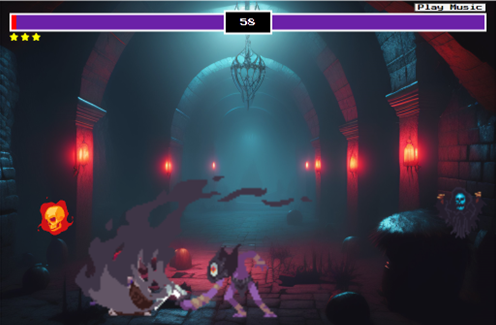

# Fighting Game

## Live Link
[Live Demo](https://huddy2022.github.io/fighting-game/)

## Overview
The Fighting Game is an engaging and dynamic web-based adventure where players embark on a heroic journey to defeat a series of enemies in one-on-one combat. The game consists of multiple levels, each presenting a new challenge for the player to overcome. The ultimate goal is to progress through all levels, face off against a formidable boss, and achieve the fastest completion time to secure a spot on the coveted leaderboard.

To advance to the next round, players must strategically navigate the battlefield, execute powerful attacks, and master the art of evasion to minimize damage. The difficulty increases with each level, requiring players to adapt their strategies to overcome the escalating challenges.

The climax of the game is the epic battle against the Boss – a formidable adversary with devastating attacks and enhanced defenses. Only the most skilled and agile players will emerge victorious and etch their names onto the leaderboard. The leaderboard showcases the fastest completion times, creating a competitive environment where players strive to outperform each other.

## Features

### `index.html` (Home Screen)
- **Description:** The landing page where players start the game, access the leaderboard, and learn how to play.
- **Features:**
  - Start Game Button: Initiates the game and redirects the player to the character selection page.
  - Player Name Input: Allows the player to enter their name before starting the game.
  - Leaderboard Button: Displays the top player scores.
  - How to Play Button: Provides instructions on how to play the game.

### `game1.html`, `game2.html`, `game3.html` (Round Levels)
- **Description:** The main game interface where players battle enemies in one-on-one combat.
- **Features:**
  - Game Canvas: Displays the game environment and characters.
  - Character Movement: Players can move left and right using 'A' and 'D' keys.
  - Jumping: Execute jumps with the 'W' key.
  - Attacks: Unleash powerful attacks using the Spacebar.
  - Enemy Behavior: Each level introduces a new enemy with unique attacks and movement patterns.
  - Health Display: Shows the player's remaining health.
  - Level Progression: Advancement to the next level upon defeating the current enemy.

### `boss.html` (Boss Battle Page)
- **Description:** The climactic final battle against a powerful boss enemy.
- **Features:**
  - Boss Enemy: Introduces a formidable boss character with advanced attacks and defenses.
  - Challenging Gameplay: Requires players to employ advanced strategies to defeat the boss.
  - Victory Conditions: Completing the boss battle signifies the end of the game.
  - Score Calculation: The faster the completion time, the higher the score.

### `leaderboard.html` (Leaderboard Page)
- **Description:** Displays the top players and their scores based on completion times/scores.
- **Features:**
  - Leaderboard Table: Lists the top players along with their rounds won, total game time, and score.
  - Reset Leaderboard Button: Allows resetting the leaderboard if needed.

### `how-to-play.html` (How to Play Page)
- **Description:** Instructions on how to play the game.
- **Features:**
  - Gameplay Instructions: Provides details on character controls, movement, attacks, and gameplay mechanics.

## Known Bugs and Issue Resolution
- **Bug:** Glitch on enemy take hit animation, as it sometimes gets stuck in a loop once hit and takes a while to get out of the loop.
- **Resolution:** Testing further I might Implement a timeout mechanism to limit the duration of the take-hit animation. 

## Technologies Used
- HTML5
- CSS3
- JavaScript (ES6)
- Canvas API
- GSAP Animation Library

## Testing

| Feature                       | Description                               | Expected Outcome                          | Status         |
|-------------------------------|-------------------------------------------|-------------------------------------------|----------------|
| **Home Screen (index.html)**   |                                           |                                           |                |
| Start Game Button              | Clicking the "Start Game" button          | Redirects to the first game level with   | Passed |
|                               |                                           | player name as a query parameter.        |                |
| Leaderboard Button             | Clicking the "Leaderboard" button         | Displays the leaderboard with the top    | Passed  |
|                               |                                           | five players.                             |                |
| How to Play Button             | Clicking the "How to Play" button         | Shows the "How to Play" instructions.    | Passed  |
| Play/Pause Music Button        | Clicking the "Play/Pause Music" button    | Toggles the background music between    | Passed |
|                               |                                           | play and pause states.                   |                |
| **Game Level 1 (game1.html)**  |                                           |                                           |                |
| Player Movement               | Using 'A' and 'D' keys to move left/right | Player moves smoothly within the         | Passed  |
|                               |                                           | boundaries.                              |                |
| Player Jump                   | Pressing 'W' key to make the player jump  | Player jumps and gravity affects the     | Passed  |
|                               |                                           | movement.                                |                |
| Player Attack                 | Pressing Spacebar to unleash attacks       | Player attacks, and attack animations    | Passed  |
|                               |                                           | play correctly.                          |                |
| Enemy Behavior                | Enemy reacts to player actions            | Enemy responds appropriately to player   | Passed  |
|                               |                                           | movements and attacks.                   |                |
| Level Completion              | Completing the level objectives           | Progresses to the next game level.       | Passed  |
| **Game Level 2 (game2.html)**  |                                           |                                           |                |
| Player Movement               | Using 'A' and 'D' keys to move left/right | Player moves smoothly within the         | Passed  |
|                               |                                           | boundaries.                              |                |
| Player Jump                   | Pressing 'W' key to make the player jump  | Player jumps and gravity affects the     | Passed  |
|                               |                                           | movement.                                |                |
| Player Attack                 | Pressing Spacebar to unleash attacks       | Player attacks, and attack animations    | Passed  |
|                               |                                           | play correctly.                          |                |
| Enemy Behavior                | Enemy reacts to player actions            | Enemy responds appropriately to player   | Passed  |
|                               |                                           | movements and attacks.                   |                |
| Level Completion              | Completing the level objectives           | Progresses to the next game level.       | Passed  |
| **Game Level 3 (game3.html)**  |                                           |                                           |                |
| Player Movement               | Using 'A' and 'D' keys to move left/right | Player moves smoothly within the         | Passed  |
|                               |                                           | boundaries.                              |                |
| Player Jump                   | Pressing 'W' key to make the player jump  | Player jumps and gravity affects the     | Passed  |
|                               |                                           | movement.                                |                |
| Player Attack                 | Pressing Spacebar to unleash attacks       | Player attacks, and attack animations    | Passed  |
|                               |                                           | play correctly.                          |                |
| Enemy Behavior                | Enemy reacts to player actions            | Enemy responds appropriately to player   | Passed  |
|                               |                                           | movements and attacks.                   |                |
| Level Completion              | Completing the level objectives           | Progresses to the next game level.       | Passed  |
| **Boss Level (boss.html)**     |                                           |                                           |                |
| Boss Behavior                 | Boss reacts to player actions             | Boss responds appropriately to player    | Passed  |
|                               |                                           | movements and attacks.                   |                |
| Game Completion               | Completing the entire game                | Redirects to the leaderboard with the    | Passed  |
|                               |                                           | player's score and details.              |                |

### Validator Testing

- HTML

I can confirm no errors were returned when passing through the official w3c validator.

- CSS

I can confirm no errors were returned when passing through the official w3c validator.

- Javascript

I used the JS Hint to check my code and I can confirm all clear and no errors were found.

- Accessibility

I used the lighthouse in dev tools to test my web page on a desktop (not designed for mobile use).

### Deployment

- The site was deployed to GitHub pages. The steps to deploy are as follows:
   - In the GitHub repository, navigate to the Settings tab
   - From the source section drop-down menu, select the Main Branch
   - Once the main branch has been selected, the page will be automatically refreshed with a detailed ribbon display to indicate the successful deployment.

The live game can be found here [Live Demo](https://huddy2022.github.io/fighting-game/)

## Credits
- [YouTube Tutorial](https://www.youtube.com/watch?v=vyqbNFMDRGQ): This YouTube tutorial provided the fundamentals for my fighting game, teaching me how to create the canvas, player, and enemy. I adapted the tutorial to transform the game into an AI fighting game.
- [Game Assets Website](https://itch.io/game-assets/tag-sprites): This website supplied the canvas, player, enemy, and object sprites for the game.
- [Music Source](https://www.chosic.com/free-music/games/): This website provided the music used in the index and all game levels.
- [Favicon Source](https://favicon.io/): This website provided me with the favicon for this game.

## Feedback
- I welcome any feedback or suggestions you may have. Feel free to reach out via my github.

Thank you for visiting my fighting game!

